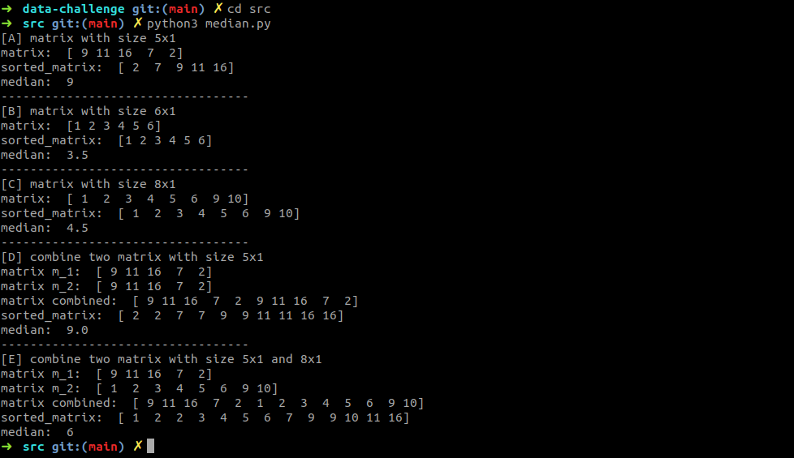

# data-challenge
Este projeto visa testar alguns conhecimentos relacionados a Engenharia de Dados

## Organização do Projeto

Este projeto está dividido em quatro partes principais, cada uma representando um desafio relacionado a `Data Engineering` que deve ser superado. Os desafios são resolvidos com scripts em `python` ou respondidos com arquivos em formato `markdown`. Abaixo você encontrará um resumo da resolução de cada desafio, bem como links para os arquivos e um `how-to` para executar os scripts caso seja necessário:

* [Parte 1](#parte-1)
* [Parte 2](#parte-2)
* [Parte 3](#parte-3)
* [Parte 4](#parte-4)

## Parte 1

Contém um script escrito em `python 3` para calcular a mediana de matrizes do tipo `_x1`, bem como a mediana da fusão de 2 ou mais matrizes do mesmo tipo mas de tamanho iguais ou distintos.

O script está localizado em [src/median.py](src/median.py) e para executá-lo basta seguir os seguintes passos:

* Certifique-se de ter alguma versão de Python 3 instalada em seu ambiente de desenvolvimento. Caso não tenha, sugiro fortemente instalar uma versão a partir do [Simple Python Version Management: pyenv](https://github.com/pyenv/pyenv)
* Abra um terminal de comando pressionando `ctrl + alt + t`
* Entre no diretório `data-challenge/src/`
* Execute `python3 median.py`
* Verifique se as medianas foram calculadas corretamente:

* Sinta-se livre para testar com mais matrizes diferentes!

## Parte 2

Contém um script escrito em `python 3` para contar e mostrar o número de soluções do problema clássico das `N Queens`.

O script está localizado em [src/n_queens.py](src/n_queens.py) e para executá-lo basta seguir os seguintes passos:

* Certifique-se de ter alguma versão de Python 3 instalada em seu ambiente de desenvolvimento. Caso não tenha, sugiro fortemente instalar uma versão a partir do [Simple Python Version Management: pyenv](https://github.com/pyenv/pyenv)
* Abra um terminal de comando pressionando `ctrl + alt + t`
* Entre no diretório `data-challenge/src/`
* Execute `python3 n_queens.py 8`, onde 8 conrresponde a quantidade de rainhas e o tamanho do tabuleiro de xadrez
* Verifique ele apresenta 92 soluções para essa solução

* Sinta-se livre para testar com mais rainhas!

## Parte 3

Contém um arquivo em formato `markdown` que responde duas perguntas a respeito de ssegurança e controle de acesso à dados.

O arquivo está localizado em [src/access_control.md](src/access_control.md)
