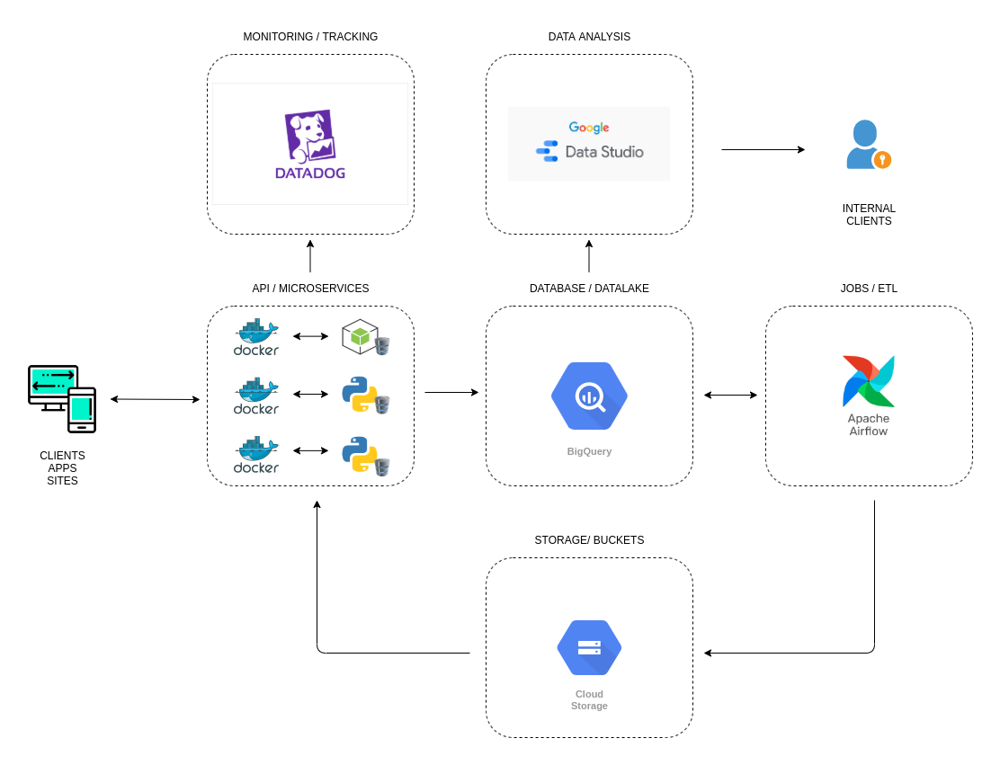

# Parte 4

## Arquitetura de Dados Ideal

Não acredito que exista uma Arquitetura de Dados Ideal que atenderá todos os casos e necessidades de dados. Acredito que isso é mais resultado de uma análise de necessidade, riscos, valores e custos que o dado representaria para uma empresa, tanto que investir em dados é uma das decisões mais difíceis que uma empresa tem que tomar. Contudo, partindo do pressuposto que essa fase já foi superada, consigo pensar em uma `Arquitetura de Dados` razoável e simples de aplicar como demostrado no diagrama abaixo:

Esta é uma Arquitetura de Dados baseada em conceitos de `Microservices` e `Cloud`, mais precisamente em `Dockerização` da infra e o `Google Cloud Plataform`.

Atualmente as melhores ferramentas para se trabalhar com Big Data ou Machine Learning se encontram na cloud do Google, e portanto nossa arquitetura tenta aproveitar muito o uso dessas ferramentas!

Para visualizarmos melhor como tudo funciona nessa arquitetura, imagine que temos um conjunto de `CLIENTS, APPS E SITES` que consomem e enviam dados diariamente para uma `API`.

Essa `API` foi desenvolvida em forma de `MICROSERVICES` e utliza orquestração de containers `Dockers` para prover rotas de serviços altamente resilientes, autocontidos e independentes.

Sempre que um desses serviços gerar ou receber um novo dado ele envia esse mesmo dado para um `DATABASE` remoto, no nosso caso ele envia para o `Big Query` do `Google Cloud Platform`. Atualmente o banco de dados não relacional mais performático e indicado para se trabalhar com um volume grande de dados. Essa ferramenta utiliza `Map-Reduce` como forma de armazenamento, o que deixa o processamento de dados muito rápido, além de ter uma interface de interação baseada em `SQL`, o que facilita ainda mais a análise dos dados em si.

De tempos em tempos, `JOBS` atomáticos orquestrados pelo `Apache Airflow` buscam esses dados previamente armazenados no `Big Query` e fazem transformações `ETLs` para deixar os dados ainda mais otimizados e organizados para futuro uso! Além de obviamente, quebrar coleções de dados muito grandes em arquivos pequenos para serem servidos de forma `SEGURA` pelos serviços da nossa `API`. O `Apache Airflow` é atualmente uma das ferramentas de orquestração de `JOBS` e `ETLs` mais utilizados, é considerado o "Estado da Arte" por muitos, na minha opinão o seu principal diferencial é a facilidade de configuração, agendamento de execução de `JOBS` e rastreabilidade de tudo que é executado através dele.

Os arquivos que antes foram quebrados e preparados para serem servidos pela nossa `API` são disponibilizados em `BUCKETS` no `Cloud Storage`. Atualmente, uma ferramenta de armazenamento do `Google Cloud Platform` tão barata e rápida quanto o seu concorrente `AWS S3`. Aqui acredito que o seu diferencial para minha escolha foi a integração automática com os demais produtos do `GCP`.

Com os dados do `Big Query` já processados e transformados pelos `JOBS` do `Airflow`, claro que com anonimização de dados e atendendo os requisitos de política de privacidade da nossa empresa. Agora, nossos colaboradores podem acessar os dados e até fazer `DATA ANALYSIS` com o objetivo de tirar `insights` a partir do `Google Data Studio`. Essa ferramenta tem uma integração nativa com o `Big Query` e possui uma interface muito rica e amigável para plotar métricas ou mesmo visualizar dados de forma fácil e rápida! Nesse ponto temos outras ferramentas tão boas quanto essa do `Google`, mas aqui estamos aproveitando sua integração facilitada com o `GCP` além de sua simplicidade.

Por fim, ainda temos nesta arquitetura o `Data Dog` configurado para fazer `MONITORING` e `TRACKING` de todos os dados e rotas que são consumidos a partir da nossa `API`. Isto é muito importante para acompanhar o desempenho da nossa Arquitetura de Dados, além de garantir a segurança dos nossos dados servidos, uma vez que podemos saber quem está consumindo nossos dados e de que forma. O `Data Dog` aqui foi escolhido por seu suporte a diversas linguagens e tecnologias, o que facilita demais a sua integração com os nossos `MICROSERVICES`, além é claro de ter uma interface de monitoramente muito fácil de usar e configurar.

Essa é uma Arquitetura de Dados que o usa o `Big Query` como uma espécie de centralizador de dados, quase um `DATA LAKE`, mas claro que para ser considerado de fato um precisaria cumprir alguns requisitos a mais de Governância de Dados, como um glossário, um catálogo de metadados, termos de responsabilidade e outros. Poderíamos tentar fazer algo muito mais complexo do que isso, mas acredito que para um propósito geral, essa arquitetura simples pode ser um ideal a ser alcançado.